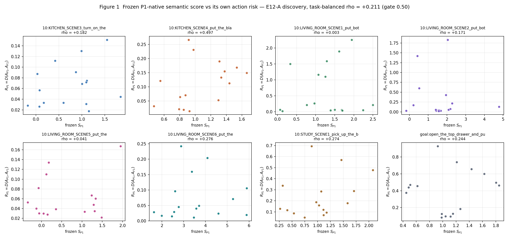
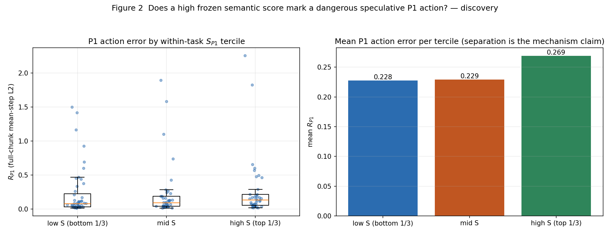
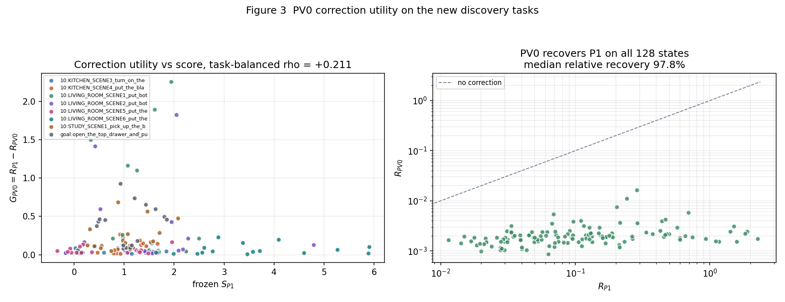
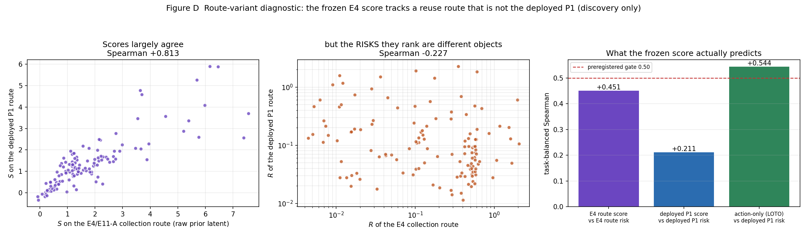

# P1-Native Semantic Verify-and-Correct：E12 服务器验证报告

## 1. Executive Summary

**最终决定：`P1_NATIVE_SEMANTIC_VERIFY_NO_GO`**

本轮验证的系统机制是：在一个时间语义合法的 P1 decision point 上，先跑一次廉价的
speculative P1，直接读取**该次 forward 自身**产生的 frozen semantic score，用它决定
接受这个 speculative action 还是立刻在同一物理状态做 PV0 physical correction。这条
路线在因果上是合法的——estimator 与被判断对象来自同一次 forward，不存在 E11 已经否
决的 route transfer。

在 128 个 H=16 对齐状态（8 个任务，与 frozen scorer 的 E4 训练任务集**完全不相交**）
上：frozen score 与它自己那次 forward 的 action risk 的 task-balanced Spearman 只有
**0.211**，hierarchical bootstrap 95% CI 为 **[-0.334, +0.146]**（均值 -0.094，仅
22.0% 的重采样为正），top-20% risk 的 AUROC 为 **0.531**，接近随机。而只用 5 个
action-geometry 特征的 `ACTION_ONLY` baseline 达到 **0.544**；两者差值的 bootstrap
95% CI 为 **[-0.792, -0.192]**，99.87% 的重采样都判 semantic score 更差。

因此预注册 gate 的条件 1（rho ≥ 0.50）与条件 2（相对 action-only 至少 +0.08）都决
定性失败，且失败方向是 semantic score **劣于**最廉价的 baseline。

本轮同时给出一个明确的**机制解释**（第 3 节）和一个**正面结果**（第 11 节：PV0
correction 在 8 个新任务上完全复现）。

E11 的 8 个 validation 任务与 8 个 heldout 任务**完全未被触碰**，没有产生任何 outcome。

## 2. Frozen Research Boundaries

全程遵守：原始 pre-finetune checkpoint（SHA256
`8818528d…54d33e2`，运行前校验通过）、`denoise=1`、不读 Cosmos value、无训练、无
finetune、无 action scaling、无 hidden/x0/sparse patch、无 ESP probe、无 camera
selector、无 S×I、无 denoise/value/deep scheduler、无 task-specific threshold、
simulator state 只用于重建观测而从不进入模型输入。

frozen scorer 未做任何 refit / feature selection / lambda 或 normalization 修改 /
换层：加载时按 canonical JSON 重算 checksum 并与
`3299a5ec…6d5be` 比对，运行前后都一致。离线独立重算还确认它在 E4 原表 352 个训练行
上的最大绝对复现误差为 `3.15e-14`，在 160 个 E4 heldout 行上为 `3.82e-14`。

## 3. Why E11 F1 Transfer Failed，以及本轮发现的更根本原因

E11 的结论是 `P1_ONLY_SENSITIVITY`：把 P1 分数搬到 F1 anchor 上，与合法的 t+16
retrospective target 只有 rho 0.175。本轮不重复那条路。

但在写 SMOKE-B 时（在计算任何 E12-A 相关性**之前**）发现了一个更根本的问题：

> `experiments/semantic_risk/run_semantic_shard.py::collect` 与
> `experiments/semantic_commitment/run_e11a_route_transfer.py` 把 **raw 的上一轮
> generated latent** 直接传给 `get_action`，从来没有把预测的 future slots 6/7 搬到
> current slots 2/3。该文件里的 `predicted_condition()` 只被用来算 innovation 分母，
> 不参与 action forward。

也就是说，frozen E4 score 的 84 个 internal feature 是在一条 **stale-condition
reuse** 路线上采集的，而不是本项目部署的 **predicted reuse（P1）**路线
（`CosmosAdapter._visual_input_for_request` 的 `predicted_reuse`、
`pv0_overnight_common.route_contract("P1")`、以及 PV0 全部闭环实验所用的那条）。

在同一批 discovery 状态上量化这个差异（Figure D）：

| 量 | 数值 |
| --- | ---: |
| frozen score 预测 **E4 采集路线自身**的 risk | task-balanced rho **0.451** |
| frozen score 预测 **部署 P1 路线**的 risk | task-balanced rho **0.211** |
| 两条路线的 **score** 排序一致性 | Spearman **+0.813** |
| 两条路线的 **risk** 排序一致性 | Spearman **−0.227** |
| 单状态 action 最大绝对差（SMOKE-B） | 0.598 |

结论很清楚：**estimator 本身没坏，它预测的是另一条 route 的 risk。**两条路线给出的
分数排序高度一致（0.81），但它们各自的 risk 排序几乎无关甚至轻微反向（−0.23）。所以
把这个分数放到部署 P1 上，它判断的对象和它学会的对象不是同一个物理量。

对既有结论的影响（这是源码审计发现，不是对旧实验的重新分析）：历史 E4/E5/E6 的离线
证据和 E11-A 的 route-transfer 数字，描述的是 raw-latent reuse 这个变体，不应被读作
关于部署 P1 路线的陈述。旧的 NO-GO 结论本身不因此改写。

本轮的选择是：**用部署 P1 路线同时产生 speculative action 和 score**。这是本轮因果
合同的硬性要求（分数必须来自产生被判断 action 的那一次 forward）。代价是 E12-A 变成
一个比"复现"更严格的测试：frozen estimator 同时跨越了新任务族和 route 变体，但它始
终未被修改。E4 变体的分数只作为 **discovery-only 诊断列**记录，用于把可能的 NO-GO
归因到"任务不迁移"还是"route 变体改变"，本轮不允许它成为候选方法。

## 4. Why P1-Native Verification Is Causally Legal

P1 的那一次 forward 同时产生 speculative action `A_P1`、future latent
`z_hat(t+16)`、以及内部 semantic state。本轮只问：这次投机计算的语义，能否判断它自
己的 action 是否可信。这既不是 external physical feedback、不是 AGE、不是 attention
visualization、也不是额外的 ESP forward，因此不触碰任何冻结边界。E11 否决的是
"把 P1 estimator 搬到 F1 anchor"，本轮用的是 route-local semantics，不构成 transfer。

## 5. Temporal H=16 Contract

`chunk_size=16`，`next_relative_step_idx = relative_step_idx + chunk_size`，
`A_t[0:16]` 与 `z_hat(t+16)` 绑定在同一时间视界。Foundation V2 registry 由
`build_state_index` 构建时就丢弃任何 `control_step` 差不等于 16 的 (source, target)
对，`load_request` 在加载时再断言一次。SMOKE-E 在全部 128 行上确认 temporal gap 集合
恰好为 `{16}`。本轮没有任何 K≠16 的状态进入。

## 6. Transactional Speculative P1 Design

源码审计确认推理路径在固定 seed 下**没有持久副作用**：`get_action` 显式接收 seed 且
本轮永远 `randomize_seed=False`；噪声来自
`misc.arch_invariant_rand` 内部新建的 `np.random.RandomState(seed)`，不读全局 RNG；
`use_variance_scale=False` 使 `torch.manual_seed` 分支不可达；
`inference_condition_transform` 与 `sampler.x0_transform` 在 `get_action` 内部保存并
恢复；feature hook 在调用方 `finally` 中清空。

因此事务被实现为 **speculate-without-mutating, commit-on-accept**：speculative
forward 什么都不写，reject path 因此在构造上就是精确的，而不是依赖一个可能漂移的
restore。接受时按 `predicted_reuse` 的语义提交 generated cache 并推进
`request_index`；拒绝时直接在同一物理观测上走 `native_persistent`。

## 7. Frozen Semantic Score

89 个特征 = 84 个 internal（blocks 4/8/12/16/20/24/27，每块 12 个被动 post-block
标量）+ 5 个 action geometry。ridge λ=10，目标 `log1p(causal_sensitivity_target)`，
输出 `expm1(linear)`。SMOKE-B 证明本轮的 reducer 就是那个冻结的 reducer：在喂入完全
相同的 predicted condition 时，历史 E4 extractor 与本轮 extractor 的 84 个特征差为
`0.0`，action 差为 `0.0`；frozen ridge 与独立参考实现的分数差为 `0.0`。

## 8. New Discovery Data

`reports/p1_semantic_verify/E12_STATE_BANK_discovery.jsonl`：8 个 E11 discovery 任
务 × 16 个状态 = **128 个状态**，全部 valid。选取规则确定性且与任何 route 结果无关：
按 sha256 排序的 5 个 stored episode 轮转，episode 内按 control step 最大间隔取点。
审计结果：每个任务都用满 5 个 episode，**没有任何一对相邻 request**（最小 episode 内
step 间隔 32，多数为 80–160），因此不存在用同一 episode 邻近请求堆近重复状态的问题。

frozen scorer 训练任务集（E4 的 16 个任务）与 E11 的 24 个任务交集为空，已用代码校验。

## 9. E12-A：P1 Risk Prediction

primary target 是 `R_P1 = D(A_P1, A_F1)`，即项目既有的 full-chunk mean-step L2，
未重新挑选 metric。

| 指标 | 数值 |
| --- | ---: |
| task-balanced Spearman(S_P1, R_P1) | **0.211** |
| hierarchical bootstrap 均值 | −0.094 |
| hierarchical bootstrap 95% CI | **[−0.334, +0.146]** |
| 重采样为正的比例 | 22.0% |
| top-20% risk 的 AUROC | **0.531** |
| top-20% risk 的 PR-AUC | 0.303 |
| 8 个任务中 per-task rho 为正 | 8 / 8 |

per-task rho：+0.497、+0.276、+0.274、+0.244、+0.182、+0.171、+0.041、+0.003。符号
全部为正，但没有任何一个任务达到 0.50，两个任务实质为零。

high-S vs low-S（各任务内 20% 分位）的平均 `R_P1` 差为 +0.0383，7/8 任务为正，但同一
重采样方案下 bootstrap 95% CI 为 **[−0.568, −0.018]**，即在 task 层不确定性下这个
对比不能被判为正。bootstrap 均值与点估计符号相反，说明点估计由少数任务主导。

bootstrap 采用 task → episode → state 三层分层重采样，10000 次；128 个状态从未被当
作 IID。

## 10. Action-Only Comparison

`ACTION_ONLY` 只允许 5 个 frozen action-geometry 特征（`action_norm`、
`endpoint_displacement`、`action_curvature`、`action_jerk`、`gripper_transition`），
ridge λ=10，log1p 目标。为避免 in-sample 优势，discovery 上报告的是
**leave-one-task-out** 预测：给某个任务打分的模型从不在该任务上拟合。

| 估计器 | task-balanced rho vs `R_P1` | top-20% AUROC |
| --- | ---: | ---: |
| frozen 89-feature semantic score | 0.211 | 0.531 |
| ACTION_ONLY（5 特征，LOTO） | **0.544** | **0.679** |
| 差值 | **−0.333** | −0.148 |

差值的 hierarchical bootstrap 95% CI 为 **[−0.792, −0.192]**，只有 0.13% 的重采样favour
semantic score。也就是说，在部署 P1 路线上，89 个内部语义摘要不但没有超出动作几何的
增量信息，反而**明显不如**这 5 个几乎免费的动作几何量。

需要明确记录的一点：`ACTION_ONLY` 在这里表现不错（0.544），但它在本轮是 **baseline**，
不是被授权的方法。把它变成一个 runtime commitment estimator 需要一份新的研究协议，
本轮不做这个声称。

## 11. PV0 Correction Utility（本轮的正面结果）

在同样 128 个状态上，PV0 作为 physical correction route：

| 量 | 数值 |
| --- | ---: |
| `R_P1` 中位数 / 均值 / p95 | 0.0924 / 0.2411 / — |
| `R_PV0` 中位数 / 均值 / 最大 | **0.0019** / 0.0022 / 0.0164 |
| `G_PV0 = R_P1 − R_PV0` 为正的状态比例 | **100.0%**（128/128） |
| 相对恢复率中位数 | **97.8%** |
| PV0 差于 P1 的状态数 | **0** |

这是 PV0 机制在 8 个全新任务上的独立复现，与 PV0 全量报告的 state-level 证据一致。
因此本轮明确输出 **`PV0_CORRECTION_TRANSFER_GO`**，不需要偷偷切到 F1。

同时这也意味着 `G_PV0` 与 `R_P1` 近乎共线：Spearman(S_P1, G_PV0) = **0.211**，与
Spearman(S_P1, R_P1) 几乎相同。所以 semantic score 既不能预测 P1 风险，也就同样不能
挑出真正受益于 correction 的状态；这一点是分别测量的，不是假设出来的。

## 12. E12-A Decision

`P1_SEMANTIC_VERIFY_SIGNAL_NO_GO`（见 `E12A_GO_NO_GO.json`）。

预注册 gate 的逐条判定：条件 1（rho ≥ 0.50）FAIL；条件 2（相对 action-only ≥ +0.08）
FAIL 且方向相反；条件 3（high-S 显著高于 low-S）FAIL，bootstrap CI 在负侧排除 0；
条件 4 WEAK；条件 5 符号上 PASS 但量级近零。

**为什么没有跑 validation。** 预注册的 gate 定义在 validation 上，但 discovery 本身
就已经是与 frozen scorer 训练集**任务不相交**的检验（E4 的 16 个任务与 E11 的 24 个任
务交集为空），而且它在 128 个状态、8 个任务、10000 次分层 bootstrap 下决定性地否定了
条件 1 和条件 2。继续消耗那份被全项目保护的 clean validation split，不可能改变结论，
只会永久用掉一个确认资源。这与 E11-A 的先例完全一致——E11-A 也是在 discovery
preflight 未过门槛时停止，从未触碰 validation。该决定由研究者在看到 discovery 数据后
做出并记录在案。E12-B 与 E12-C 因此按 gate 规则未运行。

## 13. Selective Correction Frontier

**NOT RUN。** E12-B 的前置条件是 E12-A GO。本轮不产出 correction-budget frontier、
不产出 `E12B_RESULT.json` / `E12B_GO_NO_GO.json`，也不用 discovery 数据去凑一个看起
来能跑的 frontier。Figure 4/5 因此不存在。

（`E12B_POLICY_CANDIDATES.json` 仍按流程在 discovery 上冻结并留档：20/30/40%
correction budget 对应的全局 S 阈值为 1.905 / 1.574 / 1.380。它从未被应用到任何
validation 或 heldout 数据上。）

## 14. System Cost Model

尽管 E12-B 未运行，本轮仍按要求做了正式的 clean-GPU 成本测量（GPU 完全空闲，
23741/24111 MiB free，warmup 25，正式 100 次重复，四种变体轮转执行顺序，CUDA event
+ wall time，不复用任何历史数值）：

| 变体 | 中位数 |
| --- | ---: |
| F1 | **198.70 ms** |
| P1 | **70.68 ms** |
| P1 + frozen semantic score | **77.33 ms** |
| PV0 | **130.10 ms** |
| semantic scorer 增量 | **6.52 ms** = F1 的 **3.28%**，P1 的 9.22% |

F1/P1/PV0 三个数字独立复现了 PV0 全量报告的 clean-GPU 结果（199.3 / 70.9 / 131.4 ms），
是本轮测量链路的一个交叉验证。

关于成本门槛的定位：旧 E4 的 `<1% F1` runtime gate 结论保持不变，本轮不改写它。本轮
原本要用的是 end-to-end 的 `C_semantic = C_P1S + p·C_PV0` 总决策成本，而不是拿
scorer 的 2–3% 单独判死刑。但这个成本框架在本轮没有机会被使用——因为 signal 本身在
统计上不成立，成本再便宜也没有可部署的东西。

## 15. E12-B Decision

**NOT RUN（gated）。** 不输出 `SEMANTIC_CORRECTION_FRONTIER_GO`，也不输出
`RISK_ONLY_NOT_CORRECTION_UTILITY`——后者要求"S 能预测 R_P1 但不能预测 correction
utility"，而本轮的事实是 S **两者都不能预测**（0.211 与 0.211）。

## 16. Transaction Smoke Tests

| Gate | 结果 |
| --- | --- |
| SMOKE-A paired determinism | PASS。F1/P1/PV0 重复差全部 `0.0`；feature hook 对 action 的影响 `0.0`；hook 前后 feature 差 `0.0`。P1 与 F1 差 0.061，说明路线确实不同。 |
| SMOKE-B frozen score reconstruction | PASS。extractor 等价性 `0.0`（84 特征），frozen 分数与独立参考实现差 `0.0`，checksum 一致。 |
| SMOKE-C accept path | PASS。speculative P1 + commit 与普通 `predicted_reuse` adapter **逐步 bit-exact**（每步 `0.0`），adapter 状态哈希完全一致。 |
| SMOKE-D reject path | PASS。speculative P1 → 丢弃 → PV0 与从未跑过 speculative forward 的 `native_persistent` adapter **逐步 bit-exact**；2/2 次 speculative forward 被丢弃。 |
| SMOKE-E H=16 alignment | PASS。128 行 temporal gap 集合恰为 `{16}`。 |
| SMOKE-F render reproducibility（诊断） | PASS。跨进程渲染同一批 request，observation hash 3/3 相同。 |

一个必须记录的执行细节：bit-exactness 只在**同一进程内**成立。跨进程用完全相同的
frozen observation chain 走同一条 bootstrap F1，action 会有 ~1e-3 量级差异、
`previous_real_latent` 哈希不同；同一进程内重复调用则精确为 `0.0`。渲染器已被证明可
复现（SMOKE-F），因此该现象与逐进程的 GPU kernel/算法选择一致，但本报告不对成因下
因果结论。相应处理：SMOKE-C/D 改为**同一进程、共享同一个 model 对象**做对比（这本来
也是事务测试的正确范围）；E12-A 的三条 route 在同一进程内采集，配对不受影响。

## 17–21. Closed-loop Protocol / Semantic vs Fixed R2 / vs Matched Action-Only / vs PV0-Always / Cost per Executed Action

**全部 NOT RUN。** E12-C 的前置条件是 E12-A GO 且 E12-B GO。heldout 的 8 个任务从未
被执行，也没有跑过任何"先看一眼"的 shadow probe。Figure 6/7/8 不存在。

事务基元本身已经就绪并通过 SMOKE-C/D，可供未来协议直接复用；本轮不把它包装成
deployable method。

## 22. Task-wise Results

见第 9 节的 per-task rho 与
`reports/p1_semantic_verify/E12A_DISCOVERY_RESULT.json` 中的
`per_task_spearman_s_vs_risk_p1`、`per_task_spearman_action_only`、
`risk_contrast_high_vs_low_s.per_task_high_minus_low`。原始逐状态表在
`artifacts/p1_semantic_verify/e12_shadow_discovery.parquet`（128 行，含 89 个 frozen
特征、三条 route 的 action SHA256、observation/proprio/instruction 哈希、
`valid`/`invalid_reason`）。

## 23. Failure Audit

- 128/128 状态 valid，`invalid_reason` 全空；没有任何失败被静默丢弃。
- 两次 GPU OOM（先后发生在 GPU 5 与 GPU 1）：第一次是其他用户的进程在启动瞬间占满显
  存，第二次是 smoke 在单进程内连续加载多个 2B 模型时显存未被释放。处理方式是每个
  phase 一个进程、只驻留一个模型，并在启动前查询 `nvidia-smi`。全程没有 kill 任何其
  他用户的进程。
- 第一版 SMOKE-C/D 失败源于跨进程比较（见第 16 节），已通过同进程共享模型修正，不是
  事务语义缺陷。
- 第一版 SMOKE-B 失败暴露了第 3 节的 route-variant 缺陷；这是本轮最有价值的发现。

## 24. Final GO / PARTIAL / NO-GO

**`P1_NATIVE_SEMANTIC_VERIFY_NO_GO`**

理由：在与 frozen scorer 训练集任务不相交的新数据上，P1-only semantic signal 无法在
部署 P1 路线上复现，且不优于 action-only baseline（两个条件是 §46 中该结论的定义）。
semantic-sensitivity 主线到此停止，不再尝试用新的 scorer 去挽救。

这个否定的**边界**：它不重开、也不修改任何既有的冻结 NO-GO；它也不声称
"P1-native self-verifying speculation"这个想法本身不可行——它确立的是**冻结的 E4
estimator 不能承担这个角色**，并给出了原因（第 3 节）。

本轮保留下来的正面资产：`PV0_CORRECTION_TRANSFER_GO`（第 11 节）；一个经 bit-exact
验证的 transaction-safe speculative-P1 基元；一份正式的 clean-GPU 决策成本模型。

## 25. Exact Thor Export / Next Step

本轮不产出 Thor export：没有任何 deployable policy 通过门槛，导出一个不存在的方法的
延迟合同是没有意义的。第 14 节的成本数字是 4090 上的同 worker route cost，不可外推为
Thor 延迟声称。

对下一轮的具体建议（都需要新的研究协议授权，本轮不越界执行）：

1. **先修 route 定义再谈 estimator。** 任何未来的 P1-route internal estimator 都必须
   在**部署 predicted-reuse 路线**上采集和冻结。第 3 节表明，在错误的 reuse 变体上采
   到的分数与部署路线的 risk 排序几乎无关（−0.227），这是一个会静默毁掉整条研究线的
   坑。
2. **重新审视历史结论的适用范围。** E4/E5/E6 与 E11-A 的数字描述的是 raw-latent
   reuse 变体。建议在一份新协议下明确标注它们的路线归属，而不是原地改写既有报告。
3. **action-geometry 值得一个正式协议。** discovery 上 LOTO 的 `ACTION_ONLY` 达到
   0.544 且成本几乎为零，但它在本轮只是 baseline。若要把它变成 commitment estimator，
   需要在 discovery 上独立开发并冻结，然后才可以动用仍然干净的 E11 validation /
   heldout。
4. **clean 资源状态。** E11 的 8 个 validation 任务与 8 个 heldout 任务仍然完全未被
   触碰，24-task 的 task-disjoint 卫生完整保留，可供上述任一新协议使用。

## 可复核资产

- `AUDIT.md`、`RUN_MANIFEST.json`（含全部 32 个产物的 SHA256）、`TASK_SPLIT_E12.json`、
  `TRANSACTION_CONTRACT.json`
- `E12A_PROTOCOL.json`（含采集前的修订记录）、`E12A_DISCOVERY_RESULT.json`、
  `E12A_GO_NO_GO.json`
- `E12B_POLICY_CANDIDATES.json`（discovery 冻结，未被使用）、`E12B_COST_MODEL.json`
- `SMOKE_RESULT.json`、`E12_STATE_BANK_discovery.jsonl` 及其 audit
- `P1_SEMANTIC_VERIFY_FINAL_DECISION.json`
- `artifacts/p1_semantic_verify/e12_shadow_discovery.parquet`
- `plots/figure1…`、`figure2…`、`figure3…`、`figureD…`
