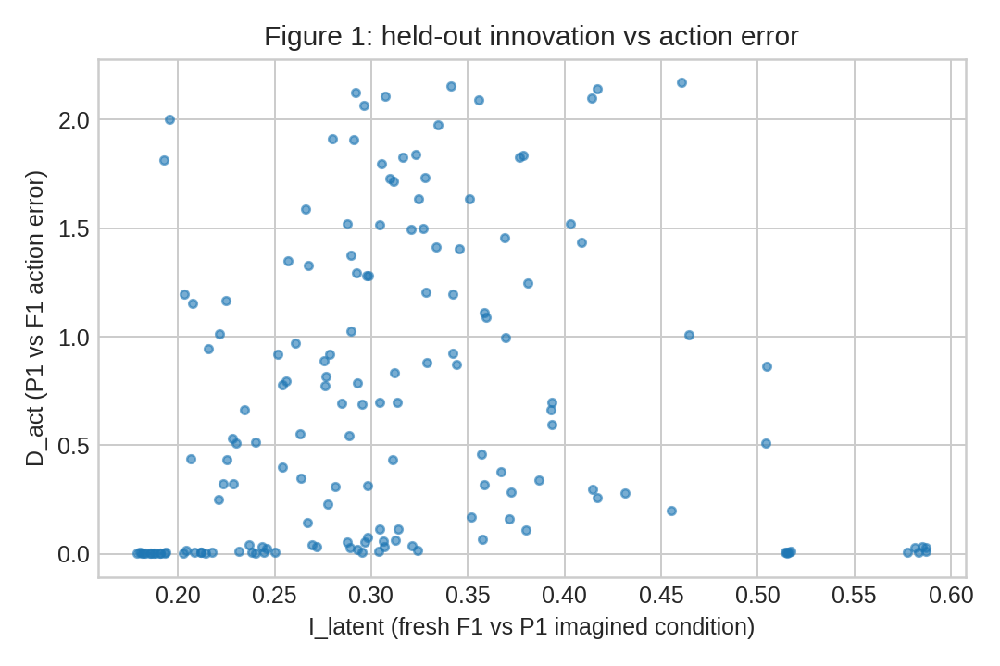
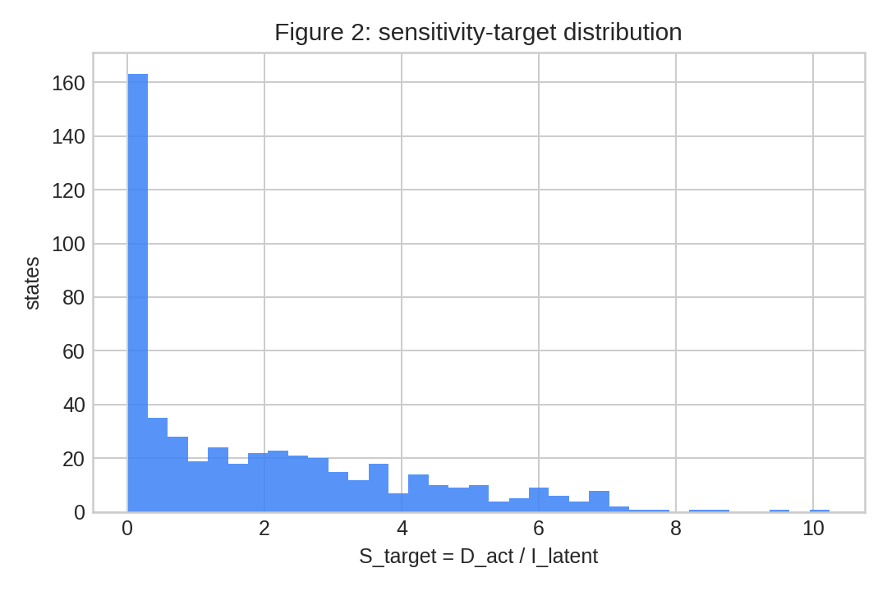
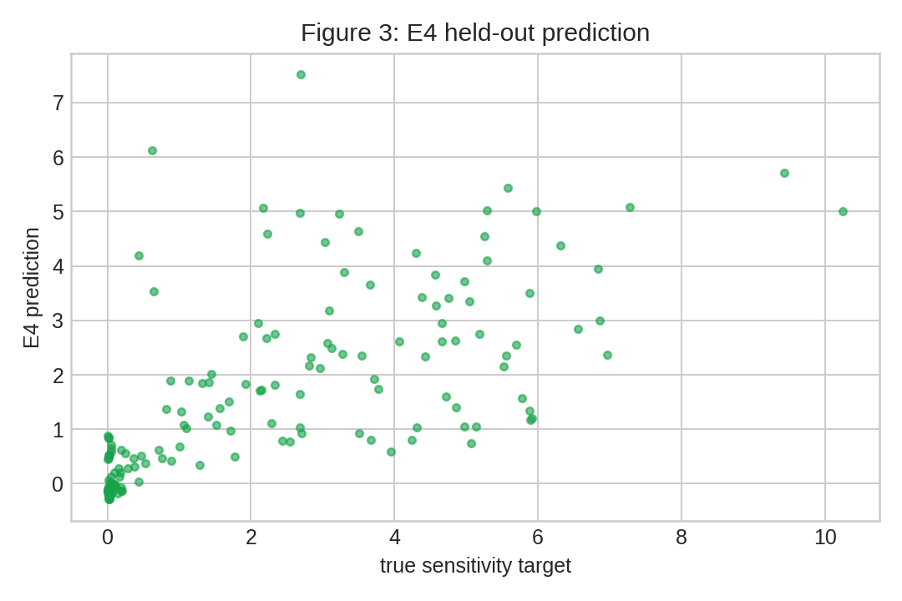
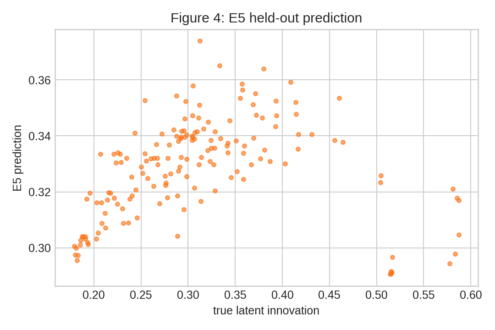
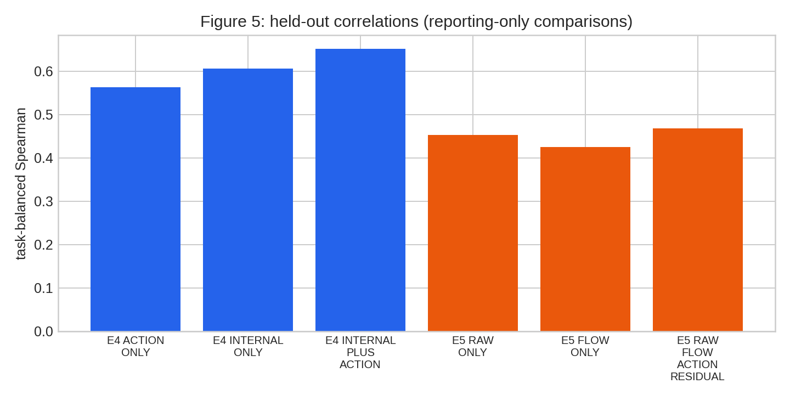
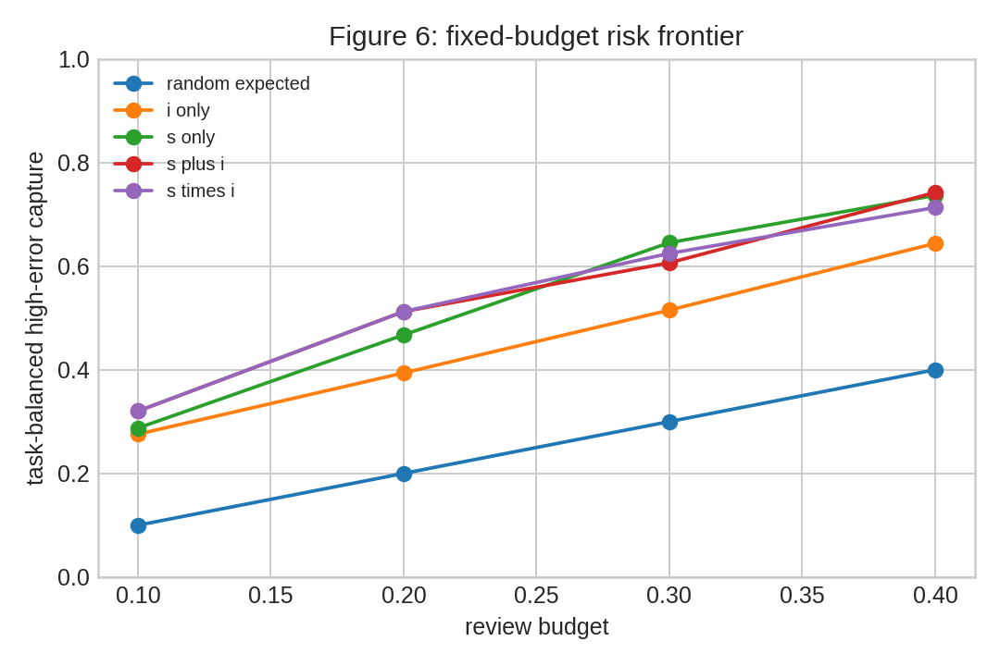
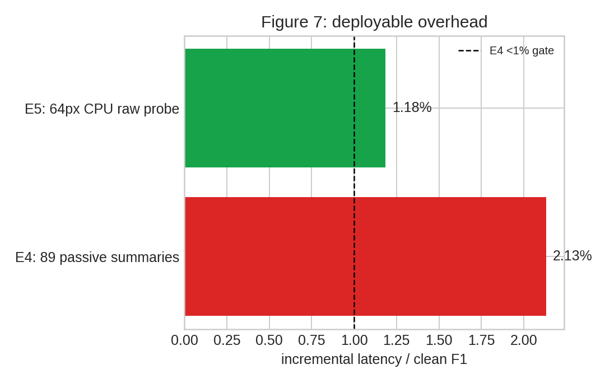

# Semantic Sensitivity × Physical Innovation：E4/E5/E6 服务器验证报告

## 最终结论：SEMANTIC_RISK_NO_GO

本轮不实现 scheduler（E7），也不把结果包装成可部署机制。512 个冻结状态、16 个 LIBERO 任务（6 discovery / 5 validation / 5 heldout，每任务 32 状态）上，E4 的离线语义信号存在，但严格实时门槛失败；E5 的廉价物理创新代理计算足够便宜，却未达到泛化门槛；E6 的乘法组合输给了加法组合。

## 运行与因果约束

- 原始、finetune 前 checkpoint：`/data/rxhuang/models/cosmos-policy-libero-2b/Cosmos-Policy-LIBERO-Predict2-2B.pt`；SHA256 `8818528d8c9150cda0ddf8c711b0f221b21dac8ac379bd26d5690235954d33e2`。
- Cosmos denoise=1；未使用 value；未训练；未使用特权 simulator state 作为模型输入。simulator state 仅用于重放图像观测。
- E4 只读取普通 P1 前向中的 post-block 被动标量摘要；没有额外模型前向、activation patch、attention probe，且没有 F1–P1 delta 进入部署特征。
- E5 仅做 64px CPU 原始帧 MAD / gradient difference / flow；没有 VAE、decode 或重模型。

## E4：语义敏感性

冻结验证选择 `INTERNAL_PLUS_ACTION`（89 个普通 P1 标量）。held-out task-balanced Spearman 为 **0.651**，高于 reporting-only `ACTION_ONLY` 的 **0.563**。因此，内部状态确有超出动作几何的离线预测信息。

但 50 次 clean-GPU CUDA-event 配对测量显示：P1 baseline 73.61 ms，带全部摘要 78.87 ms，增量 **5.25 ms**。相对于冻结的 clean F1 246.51 ms，是 **2.13%**，超过预注册 `<1% F1`。故 E4 是 **offline semantic evidence，但 deployable runtime NO-GO**；不进行事后挑层来挽救该门槛。

## E5：廉价物理创新代理

验证选择 `RAW_ONLY`（frame difference + gradient difference）。held-out task-balanced Spearman 为 **0.453**，低于 `>=0.50` GO 阈值；其中一个 held-out task 为负相关（-0.511）。

它的成本合格：512 状态上 CPU probe 中位 **2.92 ms**（p95 3.35 ms），即 clean F1 的 **1.18%**。成本不能弥补泛化不足，因此标记 **WEAK / 不进入最终方法**。

## E6：组合机制

held-out action-error task-balanced Spearman：只用 sensitivity **0.643**，只用 innovation **0.562**，加法 **0.747**，乘法 **0.734**。乘法高于两个单项，但低于加法（差 0.013），不能支撑“语义敏感性 × 物理创新”的乘法机制声明。Age 在全部状态中恒为 16 actions，无法产生排序，因此没有作出对 Age 的优越性声称。

## 图表

## 审计说明

初次报告后发现 E6 的 high-error frontier 阈值错误地从 `discovery+validation` 取值；已按预注册定义改为 **discovery-only** 并确定性重生成。该修正没有改变候选、特征、拟合类别、数据或任何采样，亦未基于 held-out 结果再选择方法。完整原始表、state bank、smoke、审计和 JSON 结果均保留在本目录及 `artifacts/semantic_risk/`。
